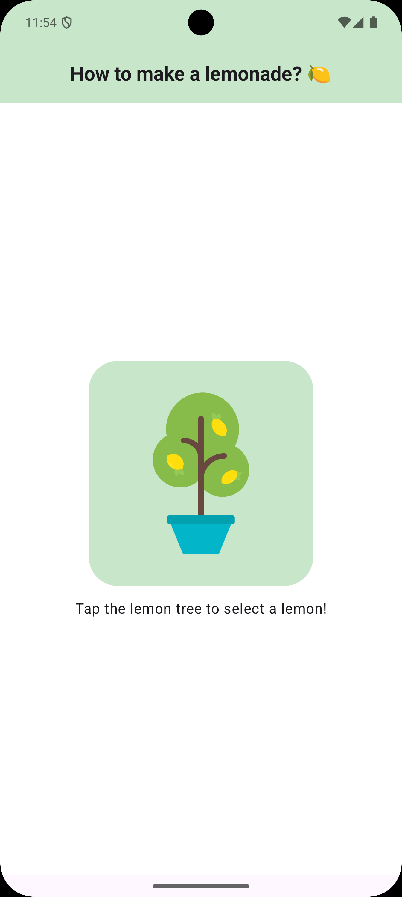
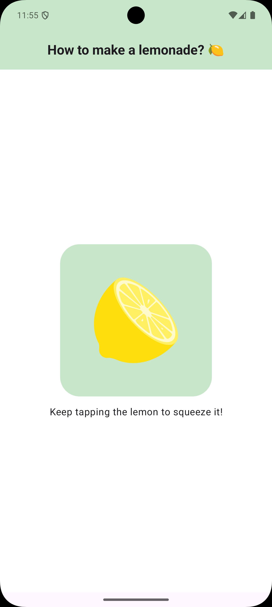
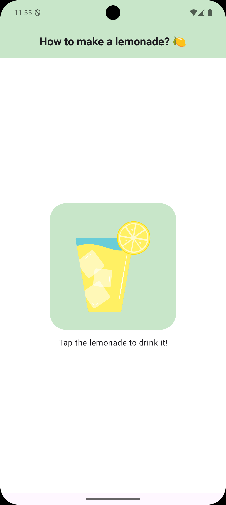
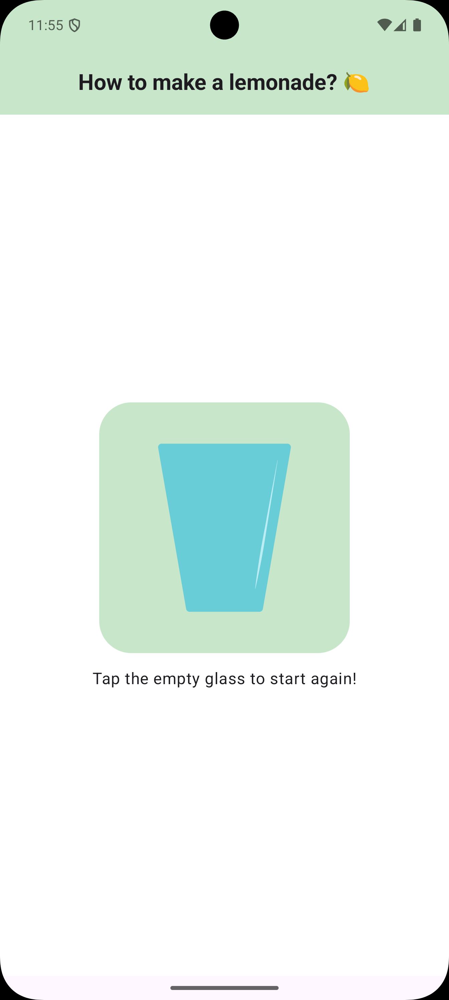

# Lemonade Click‑Behaviour Practice

> A fun Jetpack Compose app that simulates picking lemons,  
> squeezing them, drinking lemonade, and repeating—practice click interactions.

## Features

- **Step-by‑step flow**:
    1. Tap the lemon tree to pick a lemon
    2. Tap the lemon to squeeze it (2–4 squeezes)
    3. Tap the glass to drink lemonade
    4. Tap the empty glass to restart

- **Jetpack Compose**
- **Material3 theming**
- **Click‑behavior practice**

## Screenshots

| Tree             | Squeeze            | Drink             | Restart            |
|:----------------:|:------------------:|:-----------------:|:------------------:|
|  |  |  |  |

## Prerequisites

- Android Studio Bumblebee or later
- Android SDK & Kotlin configured
- Minimum API level 21 (Lollipop)